# ⚡ FAST 易支付

<p align="center">
  
</p>

<p align="center">
  <strong>个人免签支付平台 - 无需企业资质，个人收款码即可实现自动回调</strong>
</p>

<p align="center">
  <a href="https://github.com/X-TQ/bigbear-fastpay">
    
  </a>
  <a href="https://gitee.com/nchfly/bigbear-fastpay">
    
  </a>
</p>

<p align="center">
  <a href="#在线演示">在线演示</a> •
  <a href="#功能特性">功能特性</a> •
  <a href="#系统截图">系统截图</a> •
  <a href="#技术栈">技术栈</a> •
  <a href="#快速开始">快速开始</a> •
  <a href="#api-接口文档">API 文档</a>
</p>

---

## 项目介绍

FAST 易支付是一款面向个人开发者和小型商户的**免签支付平台**，通过普通收款码即可实现收款通知自动回调。资金直达个人账户，无需提现，支持绝大多数商城系统对接。

### 适用场景

- 个人网站收款
- 小型电商平台
- 知识付费系统
- 会员充值系统
- 虚拟商品交易
- 捐赠打赏系统

## 在线演示

| 系统 | 演示地址 | 账号密码 |
|------|----------|----------|
| 🏪 **商户平台** | [http://121.4.28.146/fastpay-merchant/](http://121.4.28.146/fastpay-merchant/) | `demo` / `123456` |
| 🔧 **管理后台** | [http://121.4.28.146/fastpay-admin/](http://121.4.28.146/fastpay-admin/) | - |
| 🧪 **对接演示** | [http://121.4.28.146:7002/](http://121.4.28.146:7002/) | - |

> 💡 演示环境仅供体验，请勿用于生产环境

## 功能特性

| 特性 | 说明 |
|------|------|
| 🔐 **免签约** | 无需企业资质，个人收款码即可使用 |
| ⚡ **秒到账** | 资金直达个人账户，无需提现 |
| 🔄 **自动回调** | 支付成功自动通知，支持自动重试（最多5次，递增间隔） |
| 📱 **多通道** | 支持微信、支付宝等多种支付方式 |
| 🛠️ **易对接** | 提供页面跳转支付和 API 接口两种方式 |
| 🔔 **实时推送** | WebSocket 实时推送支付结果，页面即时响应 |
| 🎨 **现代 UI** | 简洁美观的用户界面，响应式设计 |
| 📊 **数据统计** | 完善的订单统计和数据看板 |

---

## 系统截图

### 产品首页

<p align="center">
  
</p>

<p align="center">
  
</p>

### 商户中心

#### 控制台数据看板

<p align="center">
  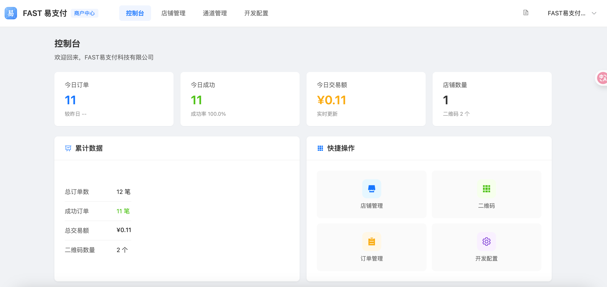
</p>

#### 店铺管理

<p align="center">
  
</p>

#### 开发参数配置

<p align="center">
  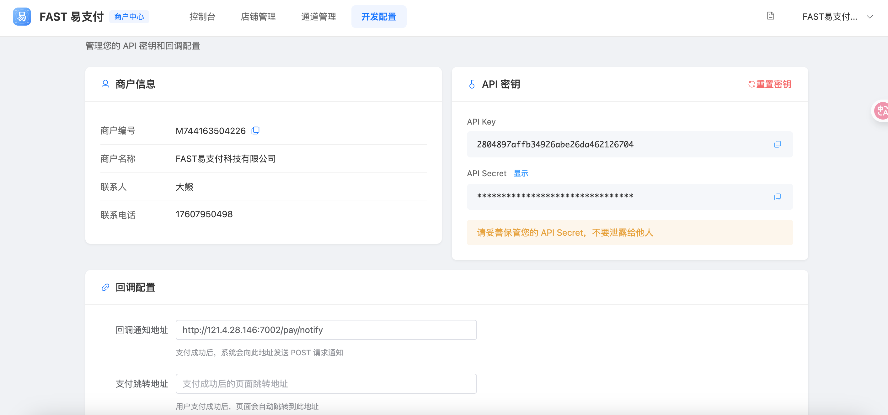
</p>

#### 消息通道

<p align="center">
  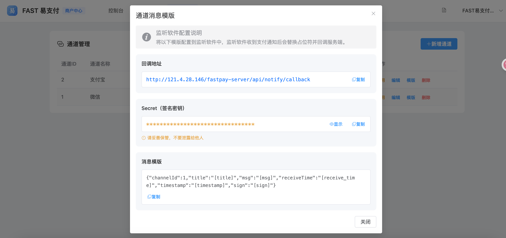
</p>

#### 开发文档

<p align="center">
  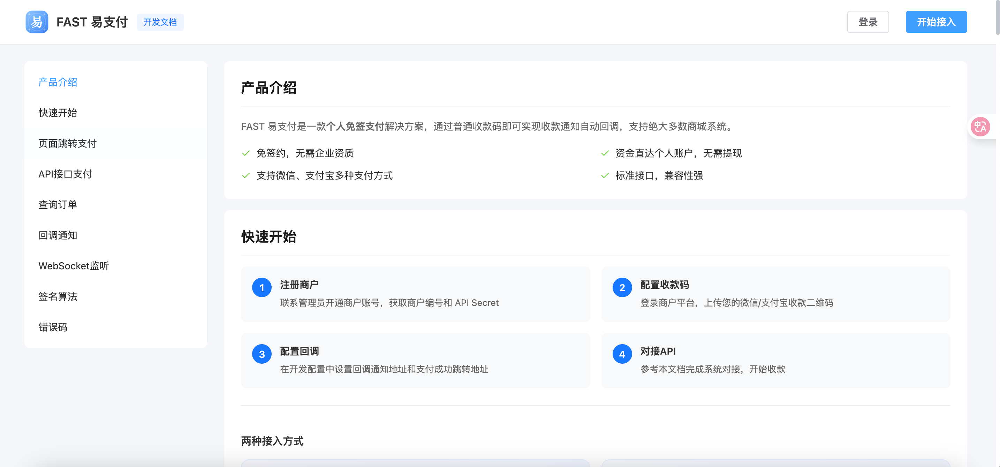
</p>

#### 开发对接

<p align="center">
  
</p>

#### 订单管理

<p align="center">
  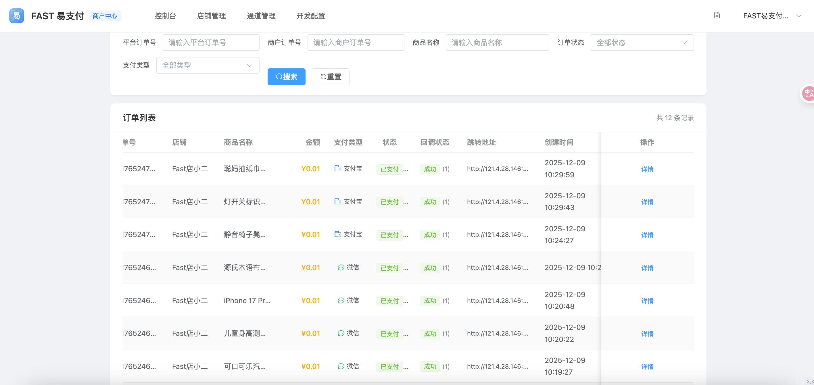
</p>

#### 订单详情

<p align="center">
  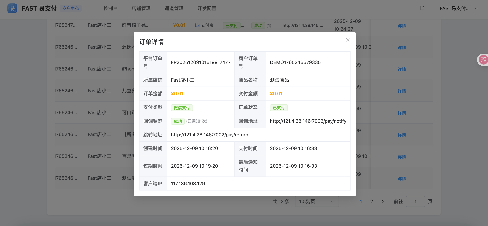
</p>

### 管理后台

#### 控制台数据看板

<p align="center">
  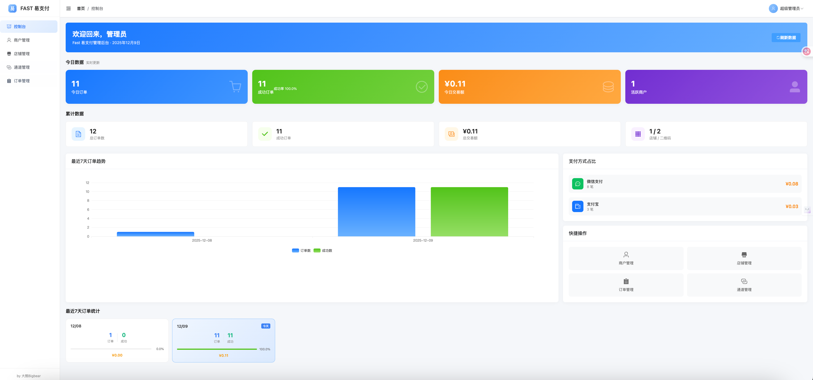
</p>

## 监听软件配置
Fastpay易支付使用的是开源监听工具是SmsForwarder。
开源项目地址：https://gitee.com/pp/SmsForwarder
### 通道配置
<p align="center">
  
</p>
<p align="center">
  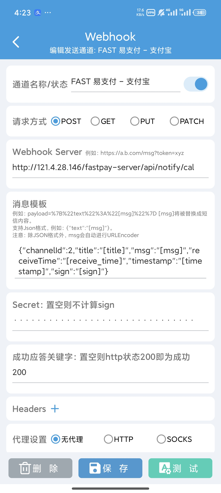
</p>

#### 转发规则配置

<p align="center">
  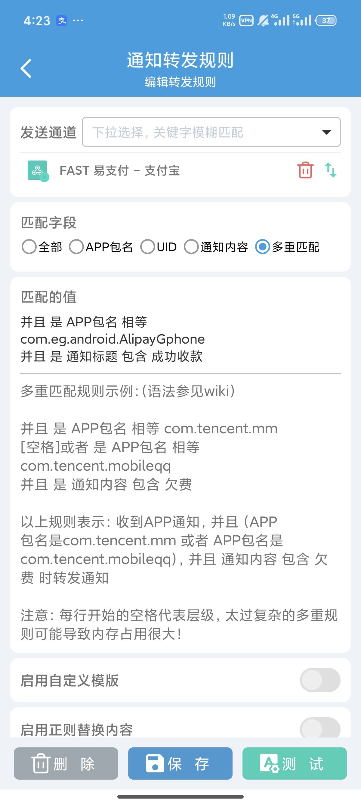
</p>
<p align="center">
  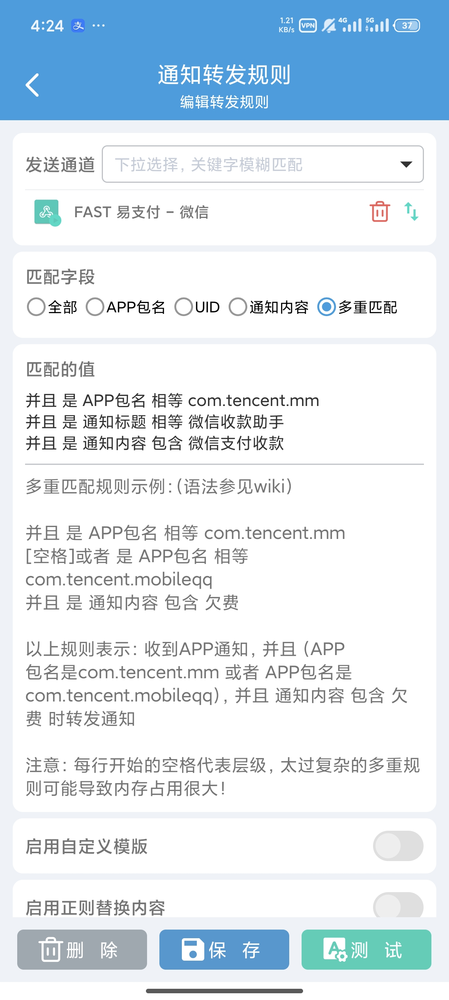
</p>

### 开发对接 Demo

#### Demo 首页

<p align="center">
  
</p>

#### 平台通用支付页面

<p align="center">
  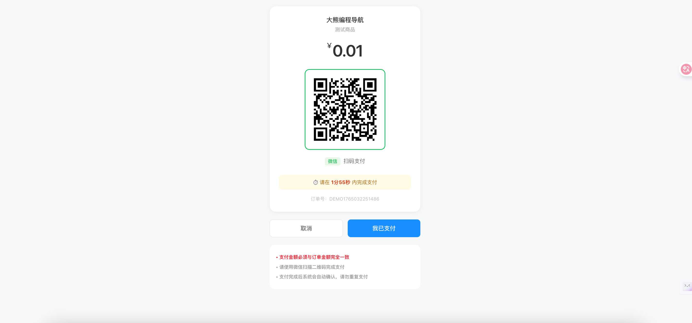
</p>

#### 商家自定义 API 支付页面

<p align="center">
  
</p>

---

## 系统架构

```
┌─────────────────────────────────────────────────────────────────────┐
│                          FAST 易支付系统                              │
├─────────────────────────────────────────────────────────────────────┤
│                                                                      │
│   ┌──────────────┐   ┌──────────────┐   ┌──────────────────────┐   │
│   │   管理后台    │   │   商户平台    │   │      支付页面         │   │
│   │   (Admin)    │   │  (Merchant)  │   │     (Pay Page)       │   │
│   │  Port: 3001  │   │  Port: 3002  │   │                      │   │
│   │              │   │              │   │  ┌────────────────┐  │   │
│   │  - 商户管理   │   │  - 店铺管理   │   │  │  收款二维码    │  │   │
│   │  - 店铺管理   │   │  - 通道管理   │   │  │  支付状态展示  │  │   │
│   │  - 订单管理   │   │  - 订单管理   │   │  │  WebSocket    │  │   │
│   │  - 数据统计   │   │  - 开发文档   │   │  └────────────────┘  │   │
│   └──────┬───────┘   └──────┬───────┘   └──────────┬───────────┘   │
│          │                  │                       │               │
│          └──────────────────┼───────────────────────┘               │
│                             │                                        │
│                      ┌──────▼──────┐                                │
│                      │   后端服务   │                                │
│                      │  (Server)   │                                │
│                      │  Port: 7001 │                                │
│                      │             │                                │
│                      │  Spring Boot 3.2                             │
│                      │  + MyBatis Plus                              │
│                      │  + WebSocket                                 │
│                      │  + JWT 认证                                  │
│                      └──────┬──────┘                                │
│                             │                                        │
│                      ┌──────▼──────┐                                │
│                      │   MySQL     │                                │
│                      │  Database   │                                │
│                      │   8.0+      │                                │
│                      └─────────────┘                                │
│                                                                      │
└─────────────────────────────────────────────────────────────────────┘
```

### 支付流程

```
商户系统 ──> 创建订单 ──> 支付网关 ──> 返回支付URL
                                          │
用户 <────────── 跳转支付页面 <────────────┘
  │
  └──> 扫码支付 ──> 监听软件检测到支付 ──> 回调通知支付网关
                                              │
                    ┌─────────────────────────┘
                    │
                    ▼
        WebSocket推送支付结果 ──> 支付页面显示成功
                    │
                    └──> 回调通知商户系统 ──> 商户处理业务
```

---

## 项目结构

```
bigbear-fastpay/
├── docs/                        # 项目文档
│   ├── PROJECT.md              # 项目说明文档
│   ├── USER_GUIDE.md           # 使用说明文档
│   └── DEMO.md                 # Demo 说明文档
│
├── fastpay-server/              # 后端服务 (Spring Boot 3.2)
│   ├── src/main/java/com/fastpay/
│   │   ├── common/              # 通用类（Result、Constants、Exception）
│   │   ├── config/              # 配置类（Web、MyBatis、JWT、WebSocket）
│   │   ├── controller/          # 控制器
│   │   │   ├── admin/           # 管理后台接口
│   │   │   ├── merchant/        # 商户平台接口
│   │   │   ├── pay/             # 支付接口
│   │   │   └── notify/          # 回调接口
│   │   ├── dto/                 # 数据传输对象
│   │   ├── entity/              # 实体类
│   │   ├── mapper/              # MyBatis Mapper
│   │   ├── service/             # 服务层
│   │   ├── task/                # 定时任务
│   │   ├── util/                # 工具类
│   │   ├── vo/                  # 视图对象
│   │   └── websocket/           # WebSocket 支付结果推送
│   └── src/main/resources/
│       ├── db/                  # 数据库脚本
│       ├── application-dev.yml  # 开发环境配置
│       └── application-prod.yml # 生产环境配置
│
├── fastpay-admin/               # 管理后台 (Vue3 + Element Plus)
│   └── src/
│       ├── api/                 # API 接口
│       ├── layout/              # 布局组件
│       ├── router/              # 路由配置
│       ├── utils/               # 工具函数
│       └── views/               # 页面组件
│           ├── dashboard/       # 控制台
│           ├── merchant/        # 商户管理
│           ├── shop/            # 店铺管理
│           ├── channel/         # 通道管理
│           └── order/           # 订单管理
│
├── fastpay-merchant/            # 商户平台 (Vue3 + Element Plus)
│   └── src/
│       ├── api/                 # API 接口
│       ├── layout/              # 布局组件
│       ├── router/              # 路由配置
│       ├── utils/               # 工具函数
│       └── views/               # 页面组件
│           ├── dashboard/       # 控制台
│           ├── shop/            # 店铺管理
│           ├── channel/         # 通道管理
│           ├── order/           # 订单管理
│           ├── config/          # 开发配置
│           ├── docs/            # 开发文档
│           └── pay/             # 支付页面
│
├── fastpay-demo/                # 对接演示项目 (Spring Boot + Thymeleaf)
│   └── src/
│       ├── main/java/com/fastpay/demo/
│       │   ├── config/          # 支付配置
│       │   ├── controller/      # 支付控制器
│       │   ├── service/         # 支付服务
│       │   └── util/            # 签名工具
│       └── main/resources/
│           ├── templates/       # 页面模板
│           └── application.yml  # 配置文件
│
└── imags/                       # 项目截图
```

---

## 技术栈

### 后端技术

| 技术 | 版本 | 说明 |
|------|------|------|
| Java | 17 | 开发语言 |
| Spring Boot | 3.2.0 | 基础框架 |
| MyBatis Plus | 3.5.5 | ORM 框架 |
| MySQL | 8.0+ | 关系型数据库 |
| JWT | 0.12.3 | 无状态身份认证 |
| WebSocket | - | 支付结果实时推送 |
| Hutool | 5.8.25 | Java 工具类库 |
| ZXing | 3.5.2 | 二维码识别 |
| Knife4j | 4.4.0 | API 文档 |
| Lombok | - | 简化代码 |

### 前端技术

| 技术 | 版本 | 说明 |
|------|------|------|
| Vue | 3.4+ | 前端框架 |
| Element Plus | 2.4+ | UI 组件库 |
| Vue Router | 4.x | 路由管理 |
| Axios | - | HTTP 请求库 |
| Vite | 5.x | 构建工具 |
| qrcode | - | 二维码生成 |
| jsQR | - | 二维码解析 |

---

## 快速开始

### 环境要求

- JDK 17+
- Node.js 18+
- MySQL 8.0+
- Maven 3.8+

### 1. 克隆项目

```bash
# GitHub
git clone https://github.com/X-TQ/bigbear-fastpay.git

# Gitee（国内镜像）
git clone https://gitee.com/nchfly/bigbear-fastpay.git

cd bigbear-fastpay
```

### 2. 数据库初始化

```sql
-- 创建数据库
CREATE DATABASE bigbear_fastpay DEFAULT CHARACTER SET utf8mb4 COLLATE utf8mb4_unicode_ci;

-- 执行初始化脚本
source fastpay-server/src/main/resources/db/init.sql
```

### 3. 启动后端服务

```bash
cd fastpay-server

# 修改配置文件 src/main/resources/application-dev.yml
# - 数据库连接信息（username、password）
# - JWT 密钥
# - 支付页面域名

# 启动服务
mvn spring-boot:run -Dspring-boot.run.profiles=dev
```

服务地址：http://localhost:7001/fastpay-server

**默认管理员账号**：`fastpay` / `123456@`

### 4. 启动管理后台

```bash
cd fastpay-admin
npm install
npm run dev
```

访问地址：http://localhost:3001

### 5. 启动商户平台

```bash
cd fastpay-merchant
npm install
npm run dev
```

访问地址：http://localhost:3002

### 6. 启动对接演示（可选）

```bash
cd fastpay-demo

# 修改配置文件 src/main/resources/application.yml
# - 商户编号、API密钥
# - 支付网关地址

mvn spring-boot:run
```

访问地址：http://localhost:8080

---

## API 接口文档

### 接口概览

| 接口 | 方法 | 说明 |
|------|------|------|
| `/api/pay/submit` | POST | 页面跳转支付 |
| `/api/pay/create` | POST | API 创建订单 |
| `/api/pay/query` | GET | 查询订单状态 |

### 页面跳转支付

适用于网站接入，通过表单提交跳转到支付页面。

**请求地址**：`POST /api/pay/submit`

**请求参数**：

| 参数 | 必填 | 类型 | 说明 |
|------|------|------|------|
| merchantNo | 是 | String | 商户编号 |
| outTradeNo | 是 | String | 商户订单号（唯一） |
| amount | 是 | String | 订单金额（元），如 10.00 |
| subject | 是 | String | 商品名称 |
| payType | 是 | String | 支付类型：wxpay / alipay |
| returnUrl | 否 | String | 支付成功后跳转地址 |
| notifyUrl | 否 | String | 异步回调地址 |
| extParam | 否 | String | 扩展参数，回调时原样返回 |
| timestamp | 是 | Long | 时间戳（秒） |
| sign | 是 | String | 签名 |

**HTML 表单示例**：

```html
<form action="https://your-domain/fastpay-server/api/pay/submit" method="POST">
  <input type="hidden" name="merchantNo" value="YOUR_MERCHANT_NO">
  <input type="hidden" name="outTradeNo" value="ORDER202512050001">
  <input type="hidden" name="amount" value="10.00">
  <input type="hidden" name="subject" value="测试商品">
  <input type="hidden" name="payType" value="wxpay">
  <input type="hidden" name="returnUrl" value="https://your-site.com/pay/result">
  <input type="hidden" name="timestamp" value="1733400000">
  <input type="hidden" name="sign" value="签名值">
  <button type="submit">立即支付</button>
</form>
```

### API 创建订单

适用于 APP 或自定义支付页面，后端调用获取收款二维码。

**请求地址**：`POST /api/pay/create`

**Content-Type**：`application/json`

**请求参数**：

```json
{
  "merchantNo": "YOUR_MERCHANT_NO",
  "outTradeNo": "ORDER202512050001",
  "amount": "10.00",
  "subject": "测试商品",
  "payType": "wxpay",
  "timestamp": 1733400000,
  "sign": "签名值"
}
```

**响应示例**：

```json
{
  "code": 0,
  "message": "success",
  "data": {
    "orderNo": "P202512050001",
    "outTradeNo": "ORDER202512050001",
    "amount": 10.00,
    "payType": "wxpay",
    "qrcodeUrl": "wxp://xxx",
    "payPageUrl": "https://your-domain/pay?orderNo=xxx",
    "expireTime": 1733403600
  }
}
```

### 签名算法

1. 将所有非空参数按 **字母顺序** 排序
2. 拼接成 `key=value&key=value` 格式
3. 最后拼接 `&key=API_SECRET`
4. 对整个字符串进行 **MD5** 加密
5. 转换为 **大写**

**Java 示例**：

```java
public static String sign(Map<String, String> params, String apiSecret) {
    // 1. 按字母顺序排序
    TreeMap<String, String> sortedParams = new TreeMap<>(params);
    
    // 2. 拼接参数
    StringBuilder sb = new StringBuilder();
    for (Map.Entry<String, String> entry : sortedParams.entrySet()) {
        if (entry.getValue() != null && !entry.getValue().isEmpty()) {
            sb.append(entry.getKey()).append("=").append(entry.getValue()).append("&");
        }
    }
    sb.append("key=").append(apiSecret);
    
    // 3. MD5 加密并转大写
    return DigestUtils.md5Hex(sb.toString()).toUpperCase();
}
```

**PHP 示例**：

```php
$params = [
    'merchantNo' => 'YOUR_MERCHANT_NO',
    'outTradeNo' => 'ORDER' . time(),
    'amount' => '10.00',
    'subject' => '测试商品',
    'payType' => 'wxpay',
    'timestamp' => time()
];

ksort($params);
$signStr = '';
foreach ($params as $k => $v) {
    if ($v !== '' && $v !== null) {
        $signStr .= $k . '=' . $v . '&';
    }
}
$signStr .= 'key=' . 'YOUR_API_SECRET';
$sign = strtoupper(md5($signStr));
```

### 回调通知

支付成功后，系统会向商户配置的 `notifyUrl` 发送 POST 请求。

**回调参数**：

| 参数 | 类型 | 说明 |
|------|------|------|
| merchantNo | String | 商户编号 |
| orderNo | String | 平台订单号 |
| outTradeNo | String | 商户订单号 |
| amount | String | 订单金额 |
| payAmount | String | 实付金额 |
| payType | String | 支付类型 |
| status | Integer | 订单状态：1-已支付 |
| payTime | String | 支付时间 |
| extParam | String | 扩展参数 |
| sign | String | 签名 |

**注意事项**：
- 商户需验证签名后返回 `success` 字符串
- 如未返回 `success`，系统会重试通知（最多 5 次，递增间隔）

---

## 对接演示

项目提供了完整的对接演示项目 `fastpay-demo`，包含：

- **页面跳转支付**：表单提交跳转到平台支付页面
- **API 接口支付**：后端调用获取二维码，自定义支付页面
- **订单状态查询**：主动查询订单支付状态
- **回调通知处理**：接收并验证支付回调
- **签名生成与验证**：完整的签名工具类

详细说明请查看 [Demo 说明文档](docs/DEMO.md)

---

## 功能模块

### 管理后台

| 模块 | 功能 |
|------|------|
| 控制台 | 数据统计、订单概览、今日/本周/本月数据 |
| 商户管理 | 商户列表、创建商户、状态管理、重置密码 |
| 店铺管理 | 店铺列表、二维码管理 |
| 通道管理 | 支付通道配置 |
| 订单管理 | 订单列表、订单详情、手动确认、重发回调 |

### 商户平台

| 模块 | 功能 |
|------|------|
| 控制台 | 数据统计、快捷操作 |
| 店铺管理 | 店铺管理、二维码管理、订单记录 |
| 通道管理 | 支付通道配置 |
| 订单管理 | 订单列表、订单详情 |
| 开发配置 | API 密钥、回调地址配置、监听软件配置 |
| 开发文档 | 接口文档、代码示例、签名说明 |

---

## 数据库设计

### 核心表结构

| 表名 | 说明 |
|------|------|
| admin | 管理员表 |
| merchant | 商户表 |
| shop | 店铺表 |
| merchant_channel | 商户通道表 |
| pay_qrcode | 收款二维码表 |
| pay_order | 支付订单表 |

---

## 部署说明

### 生产环境配置

```yaml
# application-prod.yml
server:
  port: 7001
  servlet:
    context-path: /fastpay-server

spring:
  datasource:
    url: jdbc:mysql://localhost:3306/bigbear_fastpay?useSSL=false&serverTimezone=Asia/Shanghai
    username: your_username
    password: your_password

fastpay:
  jwt:
    secret: your-jwt-secret-key
    expire-hours: 12
  pay:
    order-timeout-minutes: 3
    page-domain: https://your-domain/fastpay-merchant
```

### Nginx 配置示例

```nginx
server {
    listen 80;
    server_name pay.your-domain.com;

    # 后端 API
    location /fastpay-server {
        proxy_pass http://127.0.0.1:7001;
        proxy_set_header Host $host;
        proxy_set_header X-Real-IP $remote_addr;
        proxy_set_header X-Forwarded-For $proxy_add_x_forwarded_for;
    }

    # WebSocket
    location /fastpay-server/ws {
        proxy_pass http://127.0.0.1:7001;
        proxy_http_version 1.1;
        proxy_set_header Upgrade $http_upgrade;
        proxy_set_header Connection "upgrade";
    }

    # 商户平台前端
    location /fastpay-merchant {
        alias /var/www/fastpay-merchant/dist;
        try_files $uri $uri/ /fastpay-merchant/index.html;
    }

    # 管理后台前端
    location /fastpay-admin {
        alias /var/www/fastpay-admin/dist;
        try_files $uri $uri/ /fastpay-admin/index.html;
    }
}
```

---

## 详细文档

| 文档 | 说明 |
|------|------|
| [项目说明文档](docs/PROJECT.md) | 系统架构、技术栈、数据库设计、安全设计 |
| [使用说明文档](docs/USER_GUIDE.md) | 安装部署、功能使用、API 对接指南 |
| [Demo 说明文档](docs/DEMO.md) | 对接演示项目详细说明 |

---

## 开发者

**大熊 Bigbear**

## 许可证

MIT License

---

## 更新日志

### v1.0.0 (2025)

- 初始版本发布
- 支持微信、支付宝收款
- 页面跳转支付和 API 接口支付
- 管理后台和商户平台
- WebSocket 实时支付结果推送
- 回调通知自动重试机制（最多5次，递增间隔）
- 完整的对接演示项目
